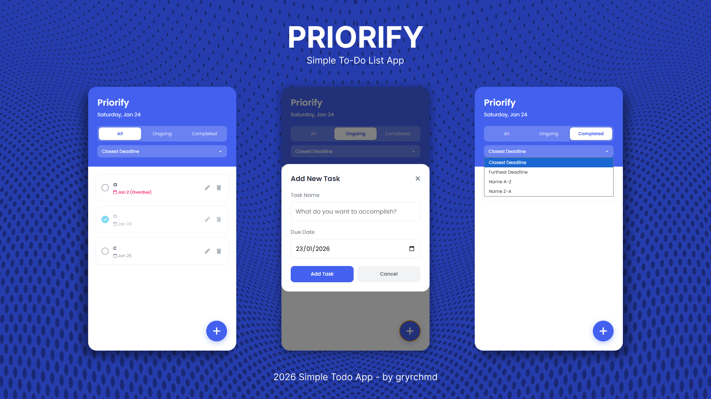

# 📝 Priorme - Simple To-Do List App

> **Mini Project for Software Engineering Coding Camp (19 Jan 2026) by RevoU**

A lightweight, responsive, and persistent Task Manager application built using **Semantic HTML**, **Vanilla CSS**, and **Modern JavaScript**. This project demonstrates DOM manipulation, LocalStorage handling, and structured code organization.

👇 Give it a try!

🔗 [Click this link](https://geryrachmadi.github.io/Priorme/)


## 📸 Screenshots


## ✨ Features

This application includes the following functionalities:

* **CRUD Operations**: Create, Read, Update, and Delete tasks.
* **Modal Form**: Clean popup interface for adding and editing tasks.
* **Data Persistence**: Uses `localStorage` so data is not lost on refresh.
* **Smart Filtering**: Filter tasks by **All**, **Pending**, or **Done**.
* **Sorting System**: Sort tasks by:
    * 📅 Date (Furthest/Nearest)
    * 🔤 Name (A-Z / Z-A)
* **Validation**: Prevents adding empty tasks.
* **Responsive Design**: Fully functional on Mobile and Desktop.
* **Visual Indicators**: Highlights overdue tasks and creates strikethrough for completed items.

## 🛠️ Tech Stack

* **HTML5**: Uses semantic tags (`<main>`, `<header>`, `<section>`) for better structure and accessibility.
* **CSS3**: Pure Vanilla CSS using CSS Variables (`:root`) and Flexbox. No external CSS frameworks (like Tailwind/Bootstrap) were used to demonstrate core CSS mastery.
* **JavaScript**: ES6+ features including Arrow Functions, Template Literals, and LocalStorage API.
* **External Assets**:
    * [FontAwesome](https://fontawesome.com/) for icons.
    * [Google Fonts](https://fonts.google.com/) (Poppins) for typography.

## 📂 Project Structure

The project follows a clean "Separation of Concerns" architecture:

```text
CodingCamp-19Jan26-Geresidi/
│
├── index.html          # Main HTML structure
├── css/
│   └── style.css       # All styling rules
├── js/
│   └── script.js       # Logic and functionality
├── image/
│   └── Priorme-screenshot.png # Web-app Display Screenshot
└── README.md           # Project documentation
```

## 🚀 How to Run
* Clone the repository:
  ```
  git clone https://github.com/GeryRachmadi/CodingCamp-19Jan26-Geresidi.git
  ```
* Navigate to the folder:
  ```
  cd CodingCamp-19Jan26-Geresidi
  ```
* **Launch**: Simply open the `index.html` file in your preferred web browser (Chrome, Edge, Firefox, etc.).

## 👤 Author
**Mohammad Geresidi Rachmadi**
* **GitHub**: [@GeryRachmadi](https://www.google.com/search?q=https://github.com/GeryRachmadi)
* **LinkedIn**: [Mohammad Geresidi Rachmadi](https://www.linkedin.com/in/mgeresidir/)
* **Instagram**: [@gryrchmd](https://www.instagram.com/gryrchmd/)
